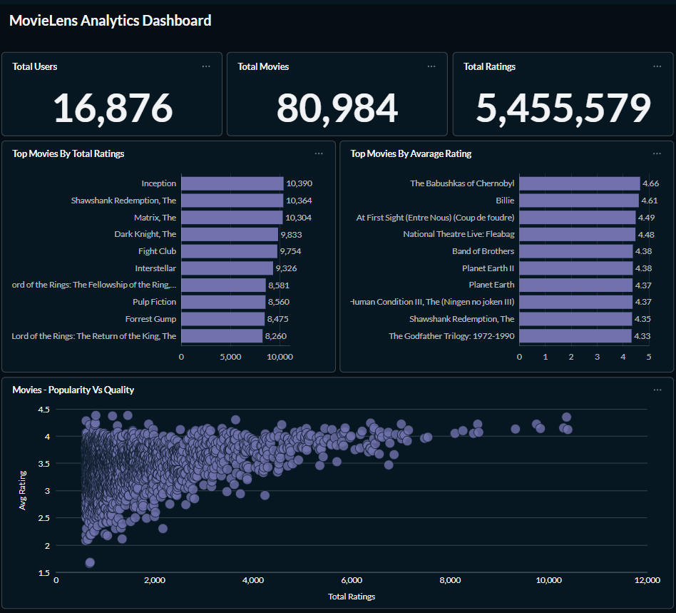
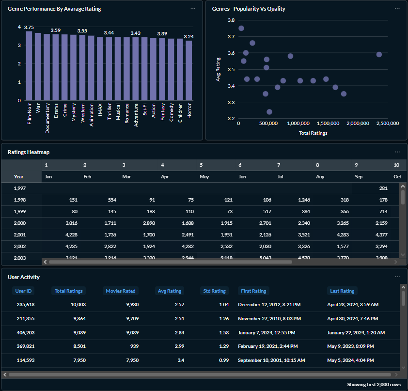

# MovieLens

**Desafio técnico 01 — Case real com BigQuery e Metabase** lançado como comunidade [Dados Por Todos](https://www.instagram.com/dadosportodos) com o objetivo de incentivar o aprendizado prático.

Pipeline de dados completo desenvolvido a partir do dataset MovieLens, com ingestão, processamento e modelagem analítica utilizando Google Cloud Platform e visualização no Metabase.

## Etapas do projeto
- [Arquitetura](#arquitetura)
- [Tecnologias Utilizadas](#tecnologias-utilizadas)
- [Coleta](#coleta)
- [Camada Bronze](#camada-bronze)
- [Camada Silver](#camada-silver)
- [Camada Gold](#camada-gold)
- [Dashboard Analítico](#dashboard-analítico)

### Arquitetura

O pipeline segue uma arquitetura moderna de dados baseada em camadas de processamento, separando responsabilidades entre ingestão, tratamento e consumo analítico.

### Tecnologias Utilizadas

- **Google Cloud Storage**
- **BigQuery**
- **SQL**
- **Metabase**
- **Docker**

### Coleta

A fonte de dados utilizada é proveniente do site [MovieLens](https://grouplens.org/datasets/movielens/ml_belief_2024/). Esses dados contêm avaliações e avaliações esperadas de filmes feitas por usuários no MovieLens entre março de 2023 e maio de 2024.

Devido ao período fixo, esses dados não receberão atualizações após sua publicação. Portanto, os dados foram baixados diretamente do site e armazenados em um bucket na plataforma do **Google Cloud Storage**.

Esses dados representarão a camada `raw`, ou camada de dados brutos.

### Camada Bronze

Nessa etapa, os arquivos `.csv` armazenados no **Google Cloud Storage** são carregados como tabelas no Google **BigQuery**, preservando sua estrutura original.

### Camada Silver

Na camada Silver são aplicadas as transformações necessárias nos dados para garantir a qualidade, consistência e organização dos dados.

As transformações realizadas foram:

- **Limpeza:** remoção de registros inconsistentes (**-1** e **NULL**) na avaliação dos filmes.
- **Padronização dos tipos:** conversão das colunas para tipos adequados.
- **Modelagem:** organização dos dados em uma estrutura com tabelas dimensão e fato.
    - as informações de **título e ano do filme** originalmente consolidadas em uma única coluna, foram separadas em colunas distintas.
    - a coluna de **gêneros**, que originalmente estava armazenada como uma string delimitada por `"|"`, foi transformada em uma tabela de dimensão e uma tabela de relacionamento entre filmes e gêneros.

As consultas SQL responsáveis pela criação dessas tabelas podem ser encontradas no diretório: `/sql/silver/`

### Camada Gold

A partir das tabelas estruturadas na camada Silver, esta camada armazena um conjunto de **views analíticas** contendo métricas agregadas e estruturas de dados preparadas para consumo. Essas views são projetadas para facilitar a análise e a integração com ferramentas de BI.

Principais views:

- `vw_movie_kpis` - Métricas agregadas das avaliações dos filmes (total, média, desvio padrão).
- `vw_top_movies` - Melhores filmes bom base na média das avaliações.
- `vw_ratings_heatmap` - Avaliações ao longo do tempo.
- `vw_scatter_popularity_vs_quality` - Métricas de média e total de avaliações dos filmes para fim de comparação.
- `vw_user_activity` - Métricas de atividade dos usuários.
- `vw_genre_performance` - Métricas agregadas das avaliações dos gêneros filmes (total, média, desvio padrão).

As consultas SQL responsáveis pela criação dessas vies podem ser encontradas no diretório: `/sql/gold/`

### Dashboard Analítico

Utilizando das views da camada analítica foi desenvolvido as seguintes visualizações:

- KPIs Gerais
    - Total de Usuários
    - Total de Filmes
    - Total de Avaliações
- Métricas de Filmes
    - Top 10 por **Total de Avaliações**
    - Top 10 por **Média de Avaliação**
    - Gráfico de Dispersão **Popularidade vs Qualidade** 
- Métricas de Gêneros
    - Top 10 por **Média de Avaliação**
    - Gráfico de Dispersão **Popularidade vs Qualidade** 
- Métricas de Atividade
    - **Mapa de Calor temporal** de avaliações
    - Tabela com métricas agregadas dos usuários

