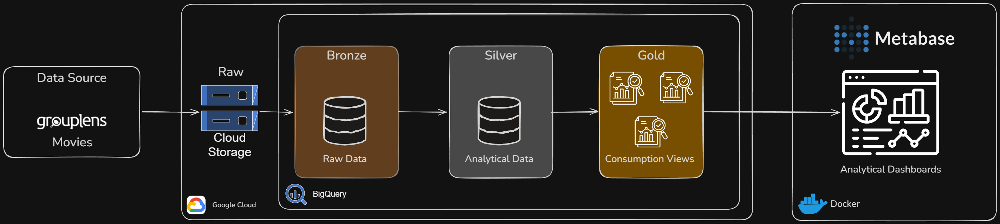
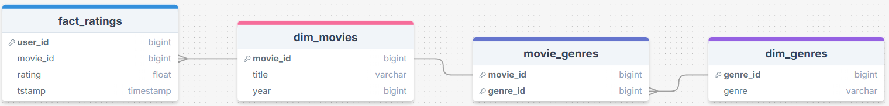

# MovieLens

Nesse projeto é efetuado a coleta, o armazenamento e o processamento de dados de filmes para o desenvolvimento de análises e dashboards.

## Etapas do projeto
- [Coleta](#coleta)
- [Camada Bronze](#camada-bronze)
- [Camada Silver](#camada-silver)

### Coleta

A fonte de dados utilizada é proveniente do site [MovieLens](https://grouplens.org/datasets/movielens/ml_belief_2024/). Esses dados contêm avaliações e avaliações esperadas de filmes feitas por usuários no MovieLens entre março de 2023 e maio de 2024.

Devido ao período fixo, esses dados não receberão atualizações após sua publicação. Portanto, os dados foram baixados diretamente do site e armazenados em um bucket na plataforma do **Google Cloud Storage**.

Esses dados representarão a camada `raw`, ou camada de dados brutos.

### Camada Bronze

Nessa etapa, os arquivos `.csv` armazenados no **Google Cloud Storage** são carregados como tabelas no Google **BigQuery**, preservando sua estrutura original.

### Camada Silver

Na camada Silver são aplicadas as transformações necessárias nos dados para garantir a qualidade, consistência e organização dos dados.

As transformações realizadas foram:

- **Limpeza:** remoção de registros inconsistentes (**-1** e **NULL**) na avaliação dos filmes.
- **Padronização dos tipos:** conversão das colunas para tipos adequados.
- **Modelagem:** organização dos dados em uma estrutura com tabelas dimensão e fato.
    - as informações de **título e ano do filme** originalmente consolidadas em uma única coluna, foram separadas em colunas distintas.
    - a coluna de **gêneros**, que originalmente estava armazenada como uma string delimitada por `"|"`, foi transformada em uma tabela de dimensão e uma tabela de relacionamento entre filmes e gêneros.

As consultas SQL responsáveis pela criação dessas tabelas podem ser encontradas no diretório: `/sql/silver/`